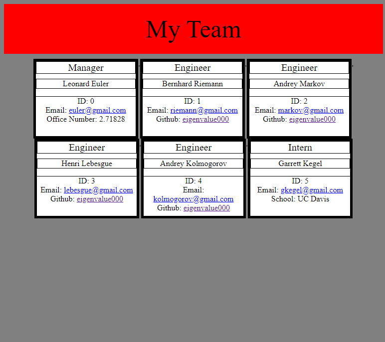
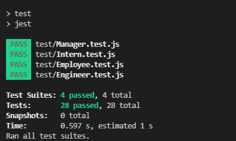

# Team Profile Generator

## Author
Garrett Kegel

## Description
The team profile generator uses node.js and
the inquirer package to prompt a user with
questions about their team. The team consists
of a manager, an engineer, and an intern.
There can only be one manager, but the user
can enter in as manay engineers and interns
as necessary for their team composition.
The team is then written to an html file
and the html file displays each team member
as a card with the inputs obtained from the
user prompt answers.
  

  
## Installation
First, clone the repository to your local
machine. Then use npm i to install the 
necessary packages from the package.json file. 

## Usage
The application will ask a sequence of questions
and the answers to the questions will be used
to generate an html webpage. Open this webpage, 
which will be located in the 
team-profile-generator folder.

Screenshot

Application Video
(https://www.youtube.com/watch?v=ioRajF2ZWag) 

## License
MIT License

Copyright (c) 2021 Garrett Kegel
    
Permission is hereby granted, free of charge, to any person obtaining a copy
of this software and associated documentation files (the "Software"), to deal
in the Software without restriction, including without limitation the rights
to use, copy, modify, merge, publish, distribute, sublicense, and/or sell
copies of the Software, and to permit persons to whom the Software is
furnished to do so, subject to the following conditions:
    
The above copyright notice and this permission notice shall be included in all
copies or substantial portions of the Software.
    
THE SOFTWARE IS PROVIDED "AS IS", WITHOUT WARRANTY OF ANY KIND, EXPRESS OR
IMPLIED, INCLUDING BUT NOT LIMITED TO THE WARRANTIES OF MERCHANTABILITY,
FITNESS FOR A PARTICULAR PURPOSE AND NONINFRINGEMENT. IN NO EVENT SHALL THE
AUTHORS OR COPYRIGHT HOLDERS BE LIABLE FOR ANY CLAIM, DAMAGES OR OTHER
LIABILITY, WHETHER IN AN ACTION OF CONTRACT, TORT OR OTHERWISE, ARISING FROM,
OUT OF OR IN CONNECTION WITH THE SOFTWARE OR THE USE OR OTHER DEALINGS IN THE
SOFTWARE.

https://www.mit.edu/~amini/LICENSE.md

## How To Contribute

## Tests
Class tests are in the test folder.

Tests Video
(https://www.youtube.com/watch?v=fOOVUMRd39w) 

## Questions

Contact the developer and owner of this repository by using the information below : 

GitHub
https://github.com/eigenvalue000

Email
qwxzjkv20946137@gmail.com

